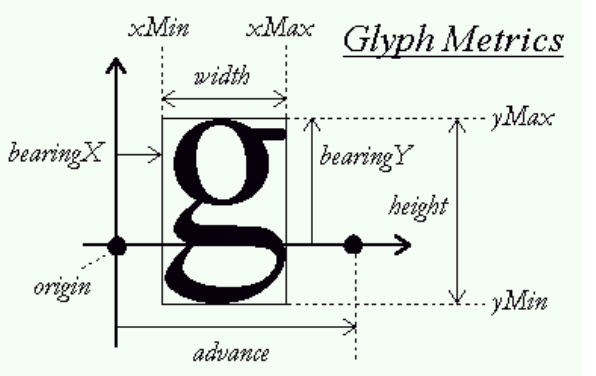

# LittlevGL中使用FreeType问题

## 问题一：噪点

直接使用FreeType返回的位图，当lvgl调用的时候回产生如下情况，字体下面会有很多的噪点：


原因：因为FreeType返回的字体位图高度不一致，而lvgl处理的时候是按照一定的字体高度进行处理，所以造成混乱，输入很多的噪点。

解决方法：对位图进行处理，高度不够的字体进行0填充，使它的高度与lvgl定义的高度一致，然后使用这个位图。代码如下：

```
memset(lv_bitmap, 0,  H_PX * bitmap->width); // H_PX为lvgl字体高度，像素为单位
memcpy(&lv_bitmap[copy_pos * bitmap->width], bitmap->buffer, bitmap->rows*bitmap->width);
```

## 问题二：字母排版

生成的bitmap正好就是文字的大小，所以把bitmap拷贝到大图像上以后必须对其进行排版。文字不能都直接拷贝入同样大小的方形子图像上，虽然对于东亚文字问题不大，但是对于西方文字会非常的难看。因为东亚文字不存在基线，字符的大小也相同；而西方的文字存在基线，文字需要对齐，字符的大小也不相同。


字体排版不是很好看，需要重新进行排版。

官方给出了一个图，根据这个图来进行排版：



获取字体的基线（origin）,在更大的位图中也需要找出一个基线（lvgl位图），两个基线对应，基线的上半部分位图是存放字体的上半部分，他的高度为bearingY，lvgl的基线减去(bearingY+1)，即可得到字体在更大图中的起始位置：完整代码如下

	uint8_t lv_origin = (uint8_t)(H_PX * 0.85);
	uint8_t copy_pos = lv_origin - slot->metrics.horiBearingY/64 - 1;
	
	copy_bitmap(&slot->bitmap,copy_pos);
```
void copy_bitmap(FT_Bitmap*  bitmap,uint8_t copy_pos)
{
    int h_count = H_PX - bitmap->rows;
    memset(lv_bitmap, 0,  H_PX * bitmap->width);
    memcpy(&lv_bitmap[copy_pos * bitmap->width], bitmap->buffer, bitmap->rows*bitmap->width);
}
```

最后效果：


