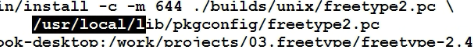
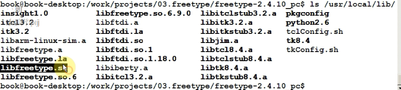
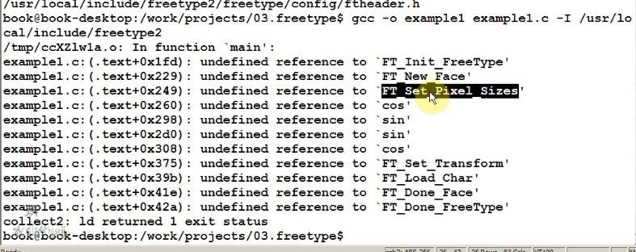
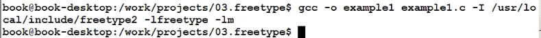

# FreeType使用

## 1 矢量字体

- 有若干条闭合的曲线关键点组成
- 使用贝塞尔曲线连接关键点
- 填充内部空间

FreeType可以显示矢量字体。

## 2 FreeType一个文字的显示过程

### 2.1 一般过程

- 给定一个文字，有确定他的编码值
- 根据编码值从字体文件中找到“glyph”
- 设置字体大小
- 用某些函数把glyph里的点所防伪字体的大小
- 转换为位图点阵
- 在LCD上显示出来

### 2.2 使用代码编写过程

-  初始化：TF_Init_Freetype
- 加载字体Face：FT_New_Face（打开字体文件）
- 设置字体大小：
  - FT_set_char_size
  - ft_set_pixel_size
- 根据编码值加载ghyph(以下这三个步骤可以使用函数FT_Load_char来代替)
  - 找到:glyph_index = FT_Get_chart_index(face,charcode)
  - 取出:FT_Load_Glyph(face_glyph_index)
  - 转换为位图：TF_Render_Glyph
- 变换（这个部分可以不做，使用FT_Set_Transform）
  - 移动
  - 旋转

## 3 在pc上进行测试

- 配置


- 编译：make

- 安装到电脑：sudo make install 

- 查看安装

  安装完成输出：

  

  使用命令ls，查看，得到如下图

  

  

-  编译测试程序

```
// -lfreetype -lm表示要链接的库
// -I /usr/local/include/freetype2头文件目录
gcc -o example1 example1.c  -I /usr/local/include/freetype2 -lfreetype -lm
gcc -finput-charset=GBK -fexec-charset=UTF-8 -o example1 example1.c  -I /usr/local/include/freetype2 -lfreetype -lm
./example1 ./simsun.ttc abc
```

如果不加`-I /usr/local/include/freetype2 -lfreetype -lm`会报错：


函数未定义：



数学函数未定义：


无错误编译：



## 4 宽字符显示中文

在linux中使用宽字符来定义变量，使每个字符都使用4个字节表示，不敢是中文还是字母。这样就可统一了编码，方便使用。