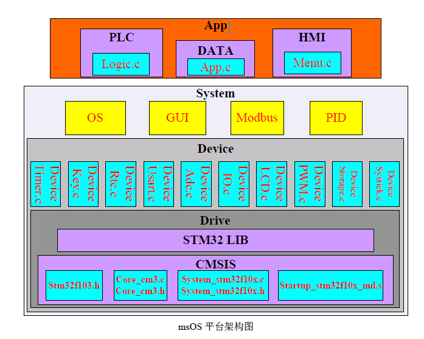
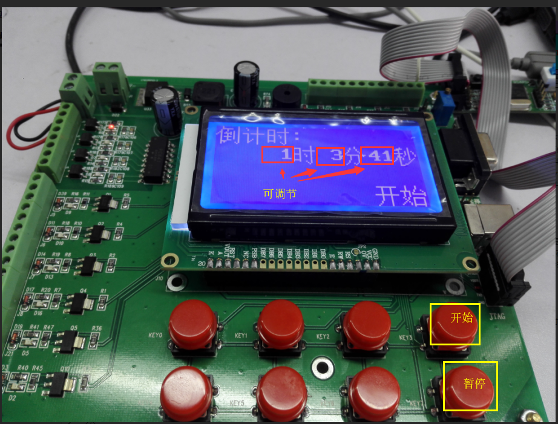
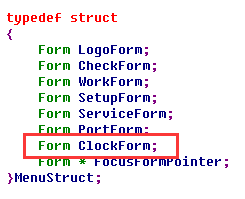

#  msOS

## 1 msOS的初步认识

刚刚拿到msOS开发板的时候，看了一下开发板，感觉非常高端，再看一下芯片，用的是stm32。当时我就觉得我得先学习stm32了，但是经过同事的介绍，发现需要使用msOS根本不需要专门的去学习stm32。经过这两天的学习，我也发现msOS真的很容易上手，我目前的认识是，对于使用msOS不需要去系统的学习stm32，对于底层的驱动msOS已经封装好了，我们直接在应用层上就可以对设备进行操作。这大大降低了开发的难度，对于一个嵌入式开发人员来说也是一个福利。总之，学习msOS可以能够快速进行项目的开发，对于嵌入式入门或者嵌入式开发人员都适用。

## 2 msOS系统框架的理解

msOS的整个系统分为：顶层为（菜单、数据库、业务处理）、中间层，即系统层（含有操作系统OS、图形用户界面GUI、Modbus协议还有PID控制算法模块）、底层驱动库函数（如定时器、ADC、串口、LCD等底层驱动函数）、内核（其内核采用了Core—M3的内核）。具体的框架图如下图所示。



整个系统从底层一步一步往上抽。在整个系统中CMSIS为最底层，对应的是ARM提供的Cortex-M内核寄存器和外设寄存器；为了封装这个底层硬件，同时也增加了一个封装头文件drive.h，在这个文件中包含了stm32f10x芯片的整个接口头文件stm32f10x.h，然后把底层统一到Drive文件夹下，形成Drive层，在Drive的文件夹下有个stm32f10x_conf.h文件，它用于配置各种外设是否被编译，可以自己定义该配置文件，来配置实际需要的外设资源，降低编译量，提高编译速度；Device层，这一层包含多个硬件驱动文件，如按键、串口。定时器等，文件的命名统一写成device_xxx，比如按键为device_key，在这一层的文件中还添加了device.c和device.h封装到整个Device层，这两个文件内放置了一些设备初始化程序及设备宏定义；在Device之上就system层，system层包含：操作系统OS、图形用户界面GUI、Modbus协议还有PID控制算法模块，通过system.c和system.h封装整个系统，并把这两个文件添加到System文件夹中；最后一层是应用层，该层由三个部分组成：入口封装文件App、业务逻辑Logic和菜单Menu。以上是各层包含的文件及作用，整个系统分为两个文件夹，App和System。各个层之间采用多层结构体进行封装，例如Device、OS和Gui都是大结构体System的成员。

## 3 应用层的理解

对于刚学习msOS的小白来说，大部分是在应用层上操作，所以对于应用层的理解是至关重要的。应用层是指App层，从应用层的结构体来看，应用层包含两个部分，一个是数据，另一个是界面，数 据是应用层的核心问题，在msOS中采用结构体封装成全局变量，形成一个数据库，当我们需要增加或者减少某个变量的时候就可以在数据库中进行增减即可，这样子就解决了全局变量满天飞的问题，这个数据库的定义在Data.h中；而对于界面包含了多个控件，每个控件对应一个结构体，这样方便了对没给个控件的属性进行设置。当创建一个界面之后，就可以往界面中添加控件，这个部分与QT界面的开发也有非常相像。 

## 4 msOS 入门实例

### 4.1 msOS定时器 

学习某一门技术的时候，通常都会有一个HelloWord，对于学习msOS来说，也有一个HelloWord，在这个过程中我选择制作基于msOS制作一个定时器作为学习msOS入门实例。该该实例的实现包括界面的显示、数据库应用、系统节拍的使用、按键处理等，都是基于msOS实现。实现的效果如下图所示，图中小时分钟和秒是可调的，当点按下开始按钮的时候，就开始倒计时，当按下暂停按钮的时候，就暂停倒计时。



### 4.2 msOS定时器实现过程

基于msOS定时器的实现具体过程如下：

（1）创建界面：首先在AppStruct的Menu中添加需要增加的界面，这个结构体在menu.h和data.h中，两个地方都要修改，如下图所示



添加完成后，接着在menu.c中创建一个我们需要添加的界面的函数，在这个函数中可以往界面中添加我们需要的控件，并对控件进行设置，实现的代码如下。对于定时器的界面主要是显示小时、分钟和秒，对于这三个部分的显示是可以修改的，所以在这里使用TextBox控件，对于这个控件可以进行读写修改。

```
static void InitClockForm(void)
{
    static TextBox HourTextBox;	
    static TextBox MinuteTextBox;
    static TextBox SecondTextBox;
    
    static Label ClockSateLabel;
    static const string ClockStateString[] = {"开始", “暂停”，“结束”};


	System.Gui.Form.Init(&App.Menu.ClockForm);
    App.Menu.ClockForm.BackTextPointer = "倒计时：        "
                                         "      时  分  秒"
                                         "                "
                                         "                ";
	
	// 小时显示
	System.Gui.Form.AddTextBox(&App.Menu.ClockForm, &HourTextBox);
	HourTextBox.DataPointer = (void *)(&App.Data.Hour);
	HourTextBox.Type = GuiDataTypeUintDec;
	HourTextBox.Digits = 2;	
	HourTextBox.DataMax = 100;
	HourTextBox.DataMin = 0;
	HourTextBox.DataBigStep = 10;
	HourTextBox.DataStep = 1;
	HourTextBox.X = 5;
	HourTextBox.Y = 1;
	
	// 分钟显示
	System.Gui.Form.AddTextBox(&App.Menu.ClockForm, &MinuteTextBox);
	MinuteTextBox.DataPointer = (void *)(&App.Data.Minute);
	MinuteTextBox.Type = GuiDataTypeUintDec;       
	MinuteTextBox.DataMax = 60;
	MinuteTextBox.DataMin = 0;
	MinuteTextBox.DataBigStep = 10;
	MinuteTextBox.DataStep = 1;
	MinuteTextBox.X = 9;
	MinuteTextBox.Y = 1;

    // 秒显示
	System.Gui.Form.AddTextBox(&App.Menu.ClockForm, &SecondTextBox);
	SecondTextBox.DataPointer = (void *)(&App.Data.Second);
	SecondTextBox.Type = GuiDataTypeUintDec;
	SecondTextBox.DataMax = 60;
	SecondTextBox.DataMin = 0;
	SecondTextBox.DataBigStep = 10;
	SecondTextBox.DataStep = 1;
	SecondTextBox.X = 13;
	SecondTextBox.Y = 1;

	// 状态显示
	System.Gui.Form.AddLabel(&App.Menu.ClockForm, &ClockSateLabel);
	ClockSateLabel.DataPointer = (void *)(&App.Data.ClockSate);
	ClockSateLabel.Type = GuiDataTypeSnString;     
	ClockSateLabel.Align = GuiDataAlignRight;
	ClockSateLabel.StringBlockPointer = ClockStateString;
	App.Data.ClockSate = ClockStop;
	ClockSateLabel.X = 15;
	ClockSateLabel.Y = 3;
}
```

对界面添加控件完成之后，把这个函数添加到界面初始化当中，如图所示。这个函数是在menu.c文件中。


（2）在数据库中添加需要保存的参数：在DataStruct结构体中添加我们需要保存的变量，在这个实例中需要保存的变量由三个时、分和秒，所以在DataStruct结构中添加这三个变量，DataStruct结构体是在data.h文件中。之后对这三个变量进行赋值，赋值是在文件App.c的InitData函数中进行赋值，完成数据的定义和赋值。当需要在界面上显示这些值的时候，直接调用即可，例如我们创建InitClockForm函数中，需要在控件上显示小时，这时候只需要HourTextBox.DataPointer = (void *)(&App.Data.Hour);就可以实现在HourTextBox控件中显示小时数值，同理在某个控件中要想显示数据库中定义好的数据，直接进行同样的操作即可。其实在这过程中我觉得主要还是数据的交换和修改，在msOS通过数据库可以很方便的对数据进行操作，很好的对数据进行管理。

（3）最后是通过系统节拍修改时、分和秒的值，在程序实现的过程中系统节拍是以没10ms进行一次扫描，当系统节拍扫描100次的时候，就是1s的时间。从而实现计时功能。然后把数值赋值给数据库中定义好的变量即可。

（4）系统自动处理消息机制：这部分主要是通过PostMessage(MessageKey, KeyLongStop)函数实现，当调用这句代码的时候，系统自动抛出一个长按按键的消息，这个是自动进行的，相当于我们在同一个按键上长按是一样的。当把消息抛出后，在节拍中接收到消息类型，进行处理。在这个实例中，当倒计时到0的时候，就会抛出一个长按的消息，在对应的长按按钮中可以设置我们想实现的操作，例如在这个例子中设置蜂鸣器响声，表示计时结束。通过这四个步骤完成定时器的实现。

## 5 总结

经过几天学习msOS，对msOS有了大概的了解。刚开始看msOS代码的时候，感觉整个系统非常的庞大，不知道从哪里入手，但是单单看代码来说，msOS的代码书写风格非常好，很多函数和结构体可以直接通过名字就能看出函数的大概作用，这颠覆我之前写C语言代码的风格。在这几天学习msOS的过程中也让我的C语言知识有了很大的提升，但是还有很需要学习的，有些地方还是不是很理解。在使用的过程中也发现，对于使用msOS创建一个界面也非常方便。最后，非常感谢王总的指导，让我对msOS有了更深的认识。