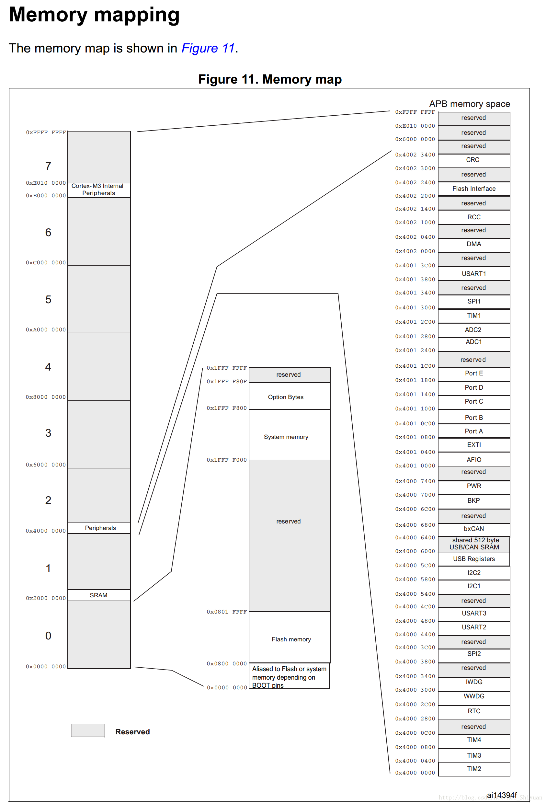
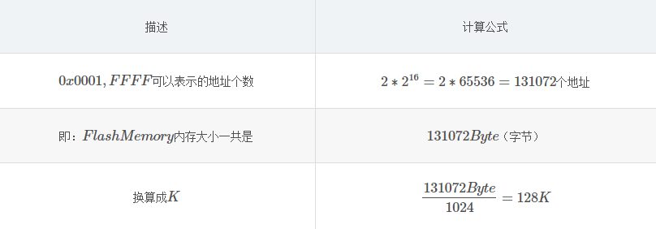
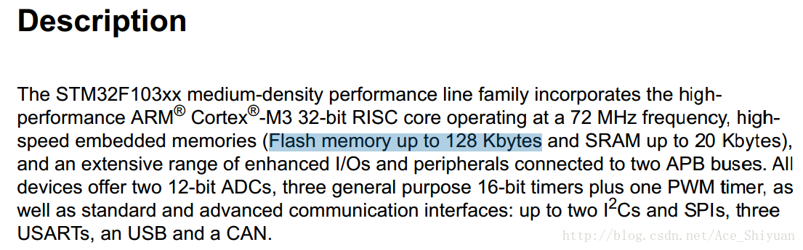

# STM32内存大小与地址的对应关系以及计算方法

## 1 概述

在计算机中要访问存储区，都是通过地址来进行访问的，包括所有的外设（比如串口、内存、硬盘等），都对应有一个访问地址，地址就相当于门牌号，有了门牌号，我们才知道操作的是哪一个区域、哪一个外设。

最被大家熟知的是计算机内存，计算机内存有4G、8G，16G等等，对于程序员而言，要在代码中操作这些内存，肯定得知道内存的地址，此外，还需要会计算地址与内存大小的计算方法与对应关系。STM32作为微型计算机，原理也是一样。

## 2 公式

**注意：在计算机中一个地址，代表一个字节（1Byte），比如：地址0x00到0x01的大小为一个字节**

计算地址和占用内存大小时，有以下关系： 

- 1G     = 1024M 
- 1M    = 1024K 

- 1K     = 1024Byte 
- 1Byte  =  8 bit      

## 3 如何通过地址计算内存大小

STM32是32位单片机，其地址范围为：0x0000 0000 ——0xFFFF FFFF

要查找每个外设对应的地址，可以在对应的用户手册的Memory mapping章节，查询各个外设对应的起始地址、结束地址（比如SPI、串口、IIC、Flash等），

例如下图中，可以查询到： 
外设SPI1的地址范围为：0x4001 3000 —— 0x4001 3400 

外设Flash的地址范围为：0x0800 0000 —— 0x0801 FFFF

我们在这里以Flash Memory为例，计算一下STM32F103系列单片机的Flash Memory大小。 

- 上图中可以查到Flash Memory地址范围为：

​       起始地址：0x0800 0000
       结尾地址：0x0801 FFFF

- 则Flash Memory最大内存 = 地址差

                                                                      =  结尾地址 - 起始地址 

                                                                      =  0x0001,FFFF

故：STM32F103系列单片机最大Flash Memory最大可以达到128K的内存，查询手册，在Description章节，可以看到介绍如下图：  

## 4 总结

| 结论  |                         内容                         |      |
| :---: | :--------------------------------------------------: | ---- |
| 结论1 | 每一个字节对应唯一的一个地址，每一个地址代表一个字节 |      |

| 描述   | 内存范围                | 最大内存大小                          |
| ------ | ----------------------- | ------------------------------------- |
| 16位机 | 0x00,00−0xFF,FF         | 2^16=65536Byte=64K                    |
| 32位机 | 0x0000,0000−0xFFFF,FFFF | 2^32=4294967296Byte=4194304K=4096M=4G |

## 转发

- [STM32内存大小与地址的对应关系以及计算方法](https://blog.csdn.net/Ace_Shiyuan/article/details/78203805?locationNum=10&fps=1#)

